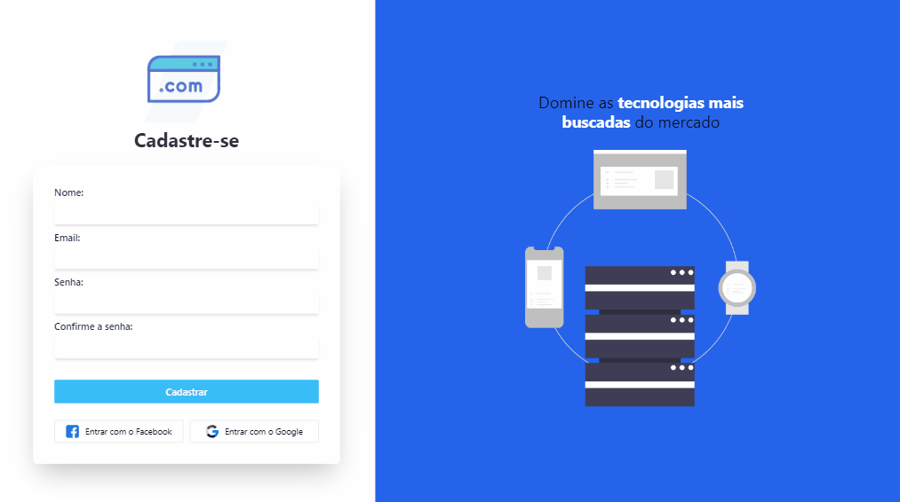
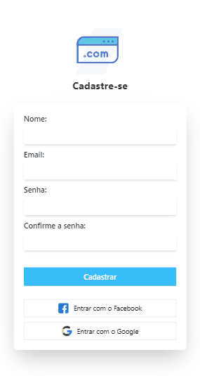

# Formulario-Cadastro-React

Utilizando as tecnologias React e Tailwind CSS,este Projeto trata-se de uma formulário de cadastro simples, mas com uma interface moderna e responsiva.A abordagem utility-first do Tailwind resultou em código mais conciso e legível, além disso, a configuração simples e a fácil integração com outros frameworks e bibliotecas aceleraram o ciclo de desenvolvimento. O React neste projeto proporciona uma arquitetura de componentes, tornando a interface do usuário modular e fácil de manter. A integração do React Hook Form otimiza a gestão do formulário, simplificando a validação e manipulação de dados de entrada.

## Layout desktop    
 

 
 
 

## Layout Mobile    

 

 
 
 

## Tecnologias utilizadas

  

## O que eu aprendi
Durante o desenvolvimento do projeto adquiri uma compreensão sobre a construção de interfaces modernas e eficientes. A utilização do React proporcionou-me uma abordagem modular e reutilizável na criação de componentes, simplificando a manutenção e promovendo uma arquitetura mais organizada. A incorporação do React Hook Form demonstrou-se valiosa ao facilitar a gestão de formulários, oferecendo uma validação eficiente e uma manipulação de dados fluida. Além disso, a integração do Tailwind CSS proporcionou-me a habilidade de criar estilos atrativos e responsivos de maneira eficaz, reduzindo o tempo de desenvolvimento e aumentando a produtividade. Essa experiência consolidou para mim a importância da combinação estratégica de tecnologias e despertou minha curiosidade para futuros projetos e a constante busca por aprimoramento
## Acesso a página

Para ver o projeto pronto [clique aqui ](https://clari-cassia-projetcs-landing-page-uber-tailwind-css.vercel.app/)

